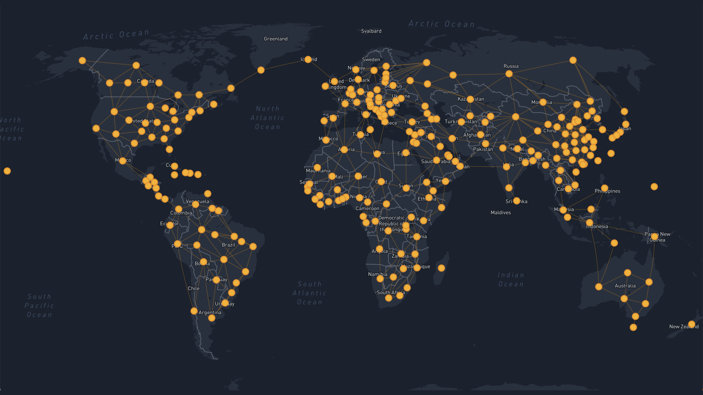

# Future Energy Outlook (FEO)



## Overview
'Future Energy Outlook' (FEO) is an open source electricity system model generator
with global coverage. It uses [OSeMOSYS Global](https://www.nature.com/articles/s41597-022-01737-0) as 
a starting point and can be used to create inter-connected energy
systems models for both the entire globe and for any geographically diverse
subset of the globe. It is built using the fully open-source 
[OSeMOSYS](https://osemosys.readthedocs.io/en/latest/) energy system modelling tool.

## Getting started

### Setup on MacOS/Linux

#### 1. Install `GLPK`

[GNU GLPK](https://www.gnu.org/software/glpk/#downloading) package is a open-source linear programming package. OSeMOSYS Global uses it to create a linear programming file.

On **Linux**, installing `GLPK` is usually straightforward and can be done by running:

```
sudo apt-get install glpk-utils
```

Meanwhile, on MacOS we can install `GLPK` using `homebrew`. If you haven't installed `homebrew` yet, you can download the `.pkg` file [here](https://github.com/Homebrew/brew/releases/tag/4.1.12) or run the following command in your terminal:

```bash
/bin/bash -c "$(curl -fsSL https://raw.githubusercontent.com/Homebrew/install/HEAD/install.sh)"
```

To verify the `homebrew` installation, type `brew -v` into your terminal. You should see an output similar to below:

```
Homebrew 4.1.12-2-g1f80e82
```

If your system did not identify the command, run the following in your terminal:

```
export PATH=/opt/homebrew/bin:$PATH
```

`homebrew` should now be setup. We can now install `GLPK` by running:

```bash
brew install glpk
```

Once installed run the command `glpsol` in the command line. The following message will display indicating that GLPK has installed correctly.

```
$ glpsol

GLPSOL: GLPK LP/MIP Solver, v4.65
No input problem file specified; try glpsol --help
```

#### 2. Install a Solver
FEO-OSeMOSYS supports three solvers: CBC, Gurobi and CPLEX. **You need at least one of these solvers for OSeMOSYS to function**. CBC is a free solver, while Gurobi and CPLEX are (expensive, but fast) commercial solvers. At TransitonZero, we tend to use Gurobi, which can be installed by following the instructions [here](https://support.gurobi.com/hc/en-us/articles/4534161999889-How-do-I-install-Gurobi-Optimizer-).

To check Gurobi has installed successfully, type `gurobi_cl --version` into your terminal, which should output as below or similar:

```
Gurobi Optimizer version 10.0.3 build v10.0.3rc0 (mac64[arm])
Copyright (c) 2023, Gurobi Optimization, LLC
```

#### 3. Clone the FEO-OSeMOSYS repository
Next, clone the `FEO-OSeMOSYS` repository by running:

```
git clone https://github.com/transition-zero/feo-esmod-osemosys
```

This will allow you to use and develop the `FEO-OSeMOSYS` modelling framework.

#### 4. Setup the FEO-OSeMOSYS environment

We now need to setup a `python` environment to install all required Python packages. You should have `conda` or `mamba` setup on your machine. If that's the case, you can setup the environment by following the instructions below.

Using `mamba`:

```
mamba env create --file=~/workflow/envs/feo-osemosys.yaml
```

Using `conda`:

```
conda env create --file=~/workflow/envs/feo-osemosys.yaml
```

#### 5. Run a small demo model
That's it! FEO-OSeMOSYS should now be installed on your machine. You can verify the install by following one of the [examples](https://feo-esmod-osemosys.readthedocs.io/en/latest/) within the FEO documentation.

## Useful Links

- [FEO Documentation](https://feo-esmod-osemosys.readthedocs.io/en/latest/)
- [OSeMOSYS Global Documentation](https://osemosys-global.readthedocs.io/en/latest/installation.html)
